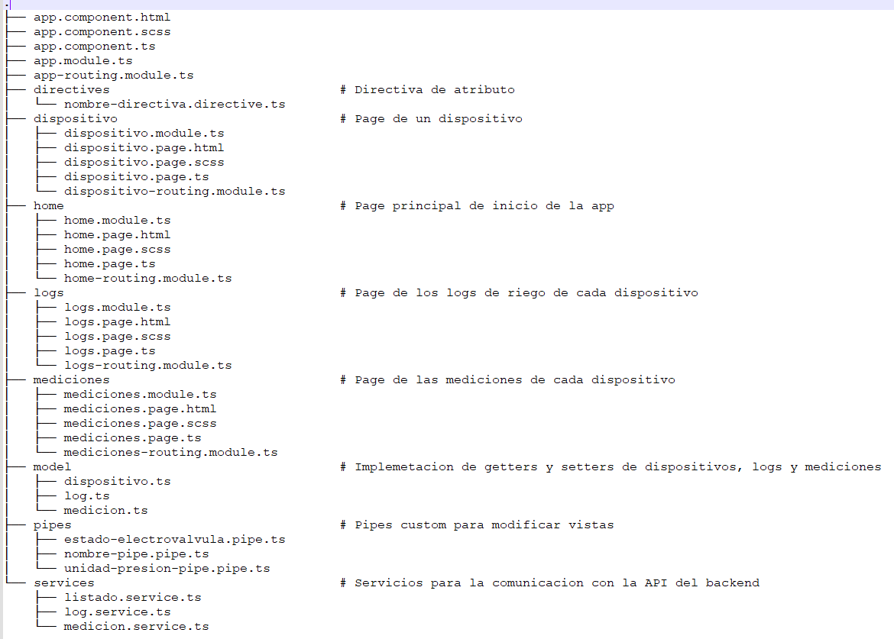

DESARROLLO DE APLICACIONES MULTIPLATAFORMA - Resolucion del TP
=======================

La consigna del trabajo práctico se detalla en el archivo: /TP/Trabajo Práctico Desarrollo de Aplicaciones Multiplataforma.pdf

La concreción implica: desarrollar una aplicación híbrida en `ionic` como frontend; desarrollar una API en `NodeJs` Express, como servidor backend y una base de datos `MySQL`, para consultar y modificar los datos.

El frontend se implementa de forma local. Tanto el backend como la base de datos se implementa sobre un ecosistema `Docker`.

Se reutilizó el ecosistema `Docker` desarrollado en la materia previa, DAW. La documentación detallada de como implementarlo se encuentra en: https://github.com/easciutto/app-fullstack-base-2022-i06 . El único cambio relevante, es que en el archivo `docker-compose.yml` no se incluye el compilador de `TypeScript`, ya que no es necesario para éste proyecto.

## Comenzando 🚀

Guía con los pasos escenciales para poner en marcha la aplicación.

<details><summary><b>Mira los pasos necesarios</b></summary><br>

### Instalar las dependencias

Para correr este proyecto es necesario instalar:

`Docker` y `Docker Compose`. Referencias en [este artículo](https://www.gotoiot.com/pages/articles/docker_installation_linux/) o en la documentación oficial de[Docker](https://docs.docker.com/get-docker/) y también la de [Docker Compose](https://docs.docker.com/compose/install/).

Instalar npm: sudo npm install -g npm@8.18.0

Instalar angular cli:sudo npm install -g @angular/cli@13.0.0

Instalar ionic cli: sudo npm i -g @ionic/cli


### Descargar el código

Para descargar el código, lo más conveniente es realizar un `fork` de este proyecto  haciendo click en [este link](https://github.com/easciutto/daw2/fork). A continuación se descarga con este comando (reeemplazando el usuario en el link):

```
git clone https://github.com/USER/daw2.git
```

> En caso de no tener una cuenta en Github, clonar directamente este repo.

### Ejecutar la aplicación

Para ejecutar el backend con la API Express y la base de datos, hay que correr el comando `docker-compose up` desde un terminal en el directorio `/TP`. Este comando va a descargar las imágenes de Docker de node, de la base datos y del admin de la DB, y luego ponerlas en funcionamiento.

Para ejecutar la aplicación en Ionic, abrir un terminal en el directorio `/easciutto_tp`. Primero ejecutar  `npm install` (para que queden instaladas las dependencias necesarias) y posteriormente `ionic serve`

Para acceder al cliente web se debe ingresar la URL [http://localhost:8100/home](http://localhost:8100/) y para acceder al admin de la DB a [localhost:8001/](http://localhost:8001/). 


> Si aparece un error la primera vez que se corre la app, detener el proceso y volver a iniciarla. Esto es debido a que el backend espera que la DB esté creada al iniciar, y en la primera ejecución puede no alcanzar a crearse. A partir de la segunda vez el problema queda solucionado.

</details>

## Configuraciones de funcionamiento 🔩

Al crearse la aplicación se ejecutan los contenedores de Docker de cada servicio, se crea la base de datos y sus tablas.

<details><summary><b>Lee cómo configurar la aplicación</b></summary><br>

### Configuración de la DB

Para acceder PHPMyAdmin, ingresar en la URL [localhost:8001/](http://localhost:8001/). En el login del administrador, el usuario para acceder a la db es `root` y contraseña es la variable `MYSQL_ROOT_PASSWORD` del archivo `docker-compose.yml`.

Para el caso del servicio de NodeJS que se comunica con la DB, en el archivo `src/backend/mysql-connector.js` están los datos de acceso para ingresar a la base.

### Estructura de la DB

Al iniciar el servicio de la base de datos, si esta no está creada toma el archivo que se encuentra en `TP/db/dumps/estructuraTPDAM-phpmyadmin.sql` para crear la base de datos automáticamente, con la estructura de tablas y atributos requeridas por la consigna del TP.

La base de datos se crea con permisos de superusuario por lo que no se puede borrar el directorio con el usuario de sistema, para eso hacerlo con permisos de administrador (comando `sudo rm -r db/data` para borrar el directorio completo).

</details>

## Detalles principales 🔍

<details><summary><b>Mira los detalles más importantes de la aplicación</b></summary><br>
<br>

### Aplicación ionic (frontend)

El frontend se comunica con el servidor backend mediante request HTTP.
La aplicación de Ionic, se compone de los siguientes directorios y archivos:




### API del backend

El servicio en **NodeJS** posee distintos endpoints para comunicarse con el cliente web mediante requests HTTP enviando **JSON** en cada transacción. Procesando estos requests es capaz de comunicarse con la base de datos para consultar y controlar el estado de los dispositivos, y devolverle una respuesta al cliente web también en formato JSON. Así mismo el servicio es capaz de servir el código del cliente web.

### La base de datos

La base de datos se comunica con el servicio de NodeJS y permite almacenar el estado de los dispositivos y electroválvulas; almacenar las mediciones historicas de de humedad y los logs de riego. Ejecuta un motor **MySQL versión 5.7** y permite que la comunicación con sus clientes pueda realizarse usando usuario y contraseña en texto plano. En versiones posteriores es necesario brindar claves de acceso, por este motivo la versión 5.7 es bastante utilizada para fases de desarrollo.

### El administrador de la DB

Para esta aplicación se usa **PHPMyAdmin**, que es un administrador de base de datos web muy utilizado y que podés utilizar en caso que quieras realizar operaciones con la base, como crear tablas, modificar columnas, hacer consultas y otras cosas más.


## Detalles de implementación 💻

En esta sección podés ver los detalles específicos de funcionamiento del código y que son los siguientes.

<details><summary><b>Mira los detalles de implementación</b></summary><br>

### Detalles de la aplicación ionic

Desde un browser, ingresando a la url : http://localhost:8100/, se visualiza la aplicación webb.

La pagina de inicio (home) muestra el listado de los dispositivos con su descripción y ubicación. Al recorrer cada dispositivo con el mouse, se resalta con otro color el elemento de la lista (se ejecuta la directiva de atributo requerida en la consigna del TP). Al hacer click sobre uno de ellos, se accede a la página de dispositivo, donde un Alert nos indica el primer valor de humedad registrado (valor aleatorio simulado). Desde la página del dispositivo seleccioando, se puede: 1) Abrir la electrovalvula para iniciar el riego (si las condicion de  humedad de suelo asi lo establece), 2) Solicitar una nueva medición de Humedad, 3)Solicitar una tabla de mediciones históricas y 4) Solicitar una tabla de logs de riego.


### Detalles del backend

Ésta implementación utiliza el paquete de funcionalidades "express" para facilitar la creación de los métodos GET y POST utilizados. También se implementa el paquete "utils", para realizar la interación con la base de datos, mediante consultas (Querys).


<details><summary><b>Ver los endpoints disponibles</b></summary><br>

A continuación verás la lista de los endpoints implementados con sus características.

1) Devolver el listado de los dispositivos.

    "method": "get"
    "url": "http://localhost:8000/api/dispositivo"
    
2) Devolver el listado de un dispositivo seleccionado en la url.

    "method": "get"
    "url": "http://localhost:8000/api/dispositivo/:id"
    
3) Devolver la última medición almacenada en la DB de un dispositivo.

    "method": "get"
    "url": "http://localhost:8000/api/dispositivo/:id/medicionActual"

4) Modificar el estado de una electrovalvula.
 
    "method": "put"
    Para el caso de solicitar su apertura: "url": "http://localhost:8000/api/electrovalvula/:id/abrir"
    Para el caso de solicitar su cierre:   "url": "http://localhost:8000/api/electrovalvula/:id/cerrar"
    
5) Devolver el listado de mediciones históricas de un dispositivo.

    "method": "get"
    "url": "http://localhost:8000/api/dispositivo/:id/mediciones"

6) Devolver el listado de logs de riego de una electroválvula.

    "method": "get"
    "url": "http://localhost:8000/api/electrovalvula/:id/logs"

7) Agregar una medición a la DB.

    "method": "post"
    "url": "http://localhost:8000/api/medicion/agregar"


## Tecnologías utilizadas 🛠️

En esta sección podés ver las tecnologías más importantes utilizadas.

<details><summary><b>Mira la lista completa de tecnologías</b></summary><br>

* [Docker](https://www.docker.com/) - Ecosistema que permite la ejecución de contenedores de software.
* [Docker Compose](https://docs.docker.com/compose/) - Herramienta que permite administrar múltiples contenedores de Docker.
* [Node JS](https://nodejs.org/es/) - Motor de ejecución de código JavaScript en backend.
* [MySQL](https://www.mysql.com/) - Base de datos para consultar y almacenar datos.
* [PHPMyAdmin](https://www.phpmyadmin.net/) - Administrador web de base de datos.
* [Material Design](https://material.io/design) - Bibliotecas de estilo responsive para aplicaciones web.
* [Angular](https://angular.io/)
* [Ionic](https://ionicframework.com/docs/)
